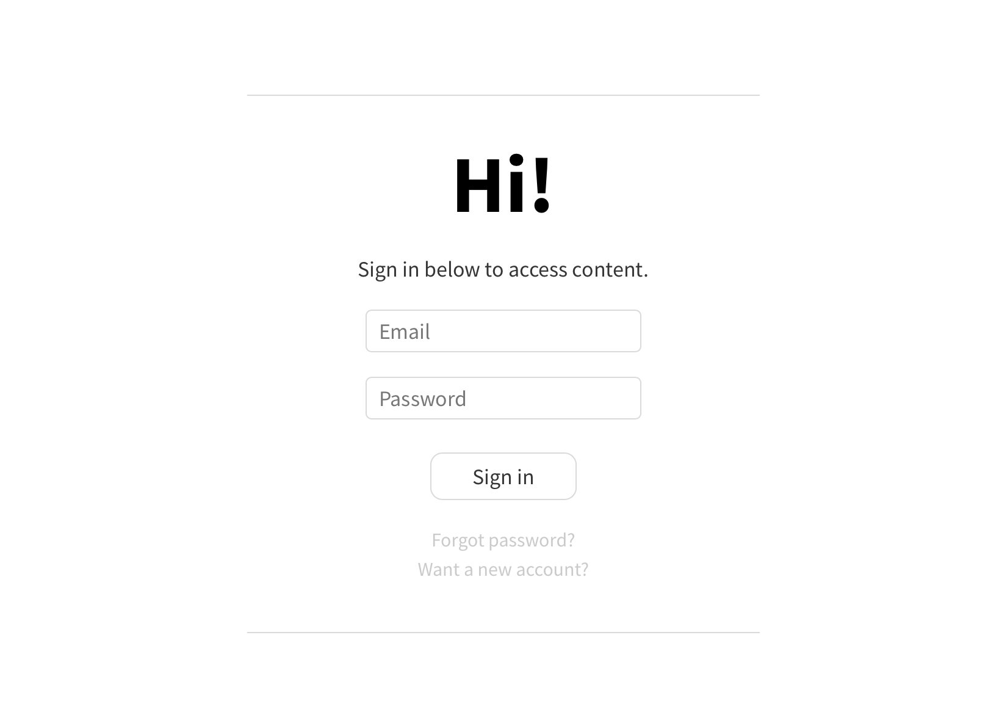

# Sign
Sign is a reusable login system that takes advantage of JWT authentication and Nodemailer to create a versatile, full-featured login page.



## Features
The back end uses Express.js and two libraries:
* JSON Web Tokens (JWT) - an authentication method that securely encodes user information into JSON objects for easy web transfer. In Sign the server sends out these tokens in secure cookies.
* Nodemailer - a mailing service that allows for sending emails directly from a Node app (a well-configured account is needed).

The front end uses Angular and has 5 different pages:
* Login.
* New Account.
* Verify New Account.
* Request for Password Reset.
* Password Reset.

## Try it out
You can try a demo of Sign [here](https://sign-vl.herokuapp.com/login/). This is a more self-contained version and does not have Nodemailer, so no verification email will be sent. You can still create new accounts and request for password resets. The server will add the accounts, and generate password reset codes. But without any email verification, the accounts will remain unverified, and the codes will be unused.

You can use this account:
* Email: test@test.com
* Password: test

A few things to try:
* Log in with the account above.
* Take a look at the JWT-carrying cookie. Open the web inspector on your browser, and look for "Cookies" in the "Storage" section (the exact path depends on the browser). Find a cookie called 'jwt'.
* Create a new account, then try to log in with it. See what happens.
* Request for a password reset.

## Use it
Sign is versatile. Download it, edit it, do whatever you like with it!

#### Requirements
To run Sign, you will need the following things:
* Node.js
* Express.js
* Angular (2+)

You should have these libraries installed for the Express.js app:
* [JSON Web Tokens](https://github.com/auth0/node-jsonwebtoken)
* [Nodemailer](nodemailer github example)

#### Directory structure
The most important folders and files are:
```
- back
  - bin
    - www
  - data
    - login
      - private.key
      - public.key
      - users.json
  - mid
    - auth.js
  - pages
    - home
    - login
  - routes
    - users.js
  - app.js

- front
  - dist
    - login
```

#### Front end
Edit the Angular app whichever way you like. After building, copy the directory ```front/dist/login``` to ```back/pages/login```, and you're done!

#### Back end
The code in this repository is complete. You can deploy it and have the same app as in the demo. The three main files are:
* ```back/app.js``` - the main Express.js app.
* ```back/routes/users.js``` - primary route to process login data.
* ```back/mid/auth.js``` - authentication middleware, checks if a user is logged in and if their credentials are valid, if not, then redirect to login page.

A few things to do before deploying:
* Change port: the app is currently set to listen on port ```31000```. You can change this to whatever port you wish in ```back/bin/www```, ```line 15```.
* Update JWT settings: there are two things you should update for JWT - expiration time and issuer. Do that in ```back/routes/users.js```, ```lines 33 and 34```. The cookie's expiration time should be equal to that of the token. You can change that in the same file, ```lines 39, 43, and 47``` (the ```maxAge``` fields). The intercepting middleware must recognize the same issuer as in the cookie. Update the same issuer value to ```back/mid/auth.js```, ```line 14```.
* Set the public-private key pair: this JWT instance uses public-key cryptography and requires a set of public-private keys for signing. An example key set is used but needs to be changed as they are public and thus defeats the point of crypto. Update the keys in ```back/data/login/private.key``` and ```back/data/login/public.key```.
* Initialize Nodemailer: the app contains code for Nodemailer, but since an active email account is needed, it is unused and commented out in the original version. Head to ```back/routes/users.js```, look for the commented sections, and either modify them, or delete them altogether if you have no need for Nodemailer.
*

## License
Sign is open for all to use under the MIT License.
